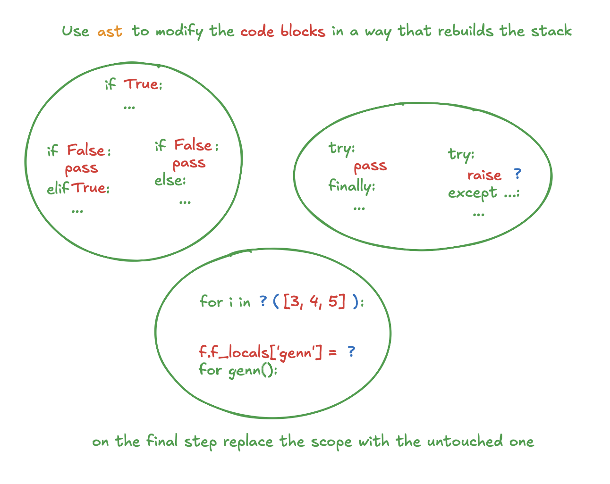

Usage: python3 dump.py `<file>` `<line number>`

Usage: python3 restore.py `<file>`

example:
```
source env.sh

python3 dump.py file.py 43
python3 restore.py file.py
```

https://youtu.be/B2ElZK0u85Y&t=60s

---

### Next steps:
- rebuild the function stack: if, try, with, for, etc.
- dump and restore generators
- restore file descriptors
- figure out dumping mid-transaction
- optionally rerun some lines that user wants?
- async/await 🌚
- threads 🌚

thease are not yet implemented/tested ^

### Possible way to move forward?

