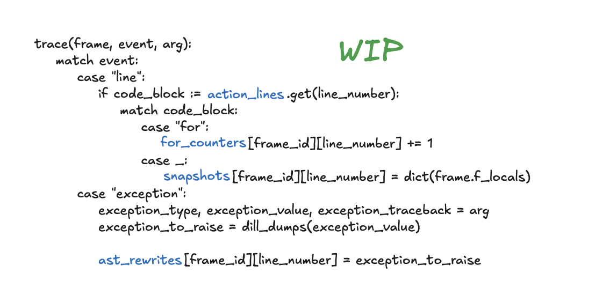

https://youtu.be/B2ElZK0u85Y&t=60s

---

### Main idea:

``` python
import sys

frame = sys._getframe()
```

``` python
from types import FrameType
from typing import Iterator

def get_frame_stack(frame: FrameType) -> Iterator[FrameType]:
    """Yield frames from the root frame to the given frame."""
    stack: list[FrameType] = []
    stack_append = stack.append
    
    while frame:
        stack_append(frame)
        frame = frame.f_back
    
    yield from reversed(stack)
```

extract all useful data, save it and rebuild the state in a new program.

### Work in progress

Curently working on: saving and applying ast rewrites, finding out current iteration for dumps

- rebuild the block stack: ~~if~~, ~~try~~, for, with, etc.
- dump and restore generators
- restore file descriptors
- figure out dumping mid-transaction
- optionally rerun some lines that user wants?
- async/await 🌚
- threads 🌚

thease are not yet implemented/tested ^




### Call stack


### Restore process


---

CURRENTLY BROKEN ⚠️, try `4afa151` or `6a61853`

---

Usage: python3 dump.py `<file>` `<line number>` `<?iteration>`

Usage: python3 restore.py `<file>`

example:
```
source env.sh

python3 dump.py test_files/file.py 43
python3 restore.py test_files/file.py
```